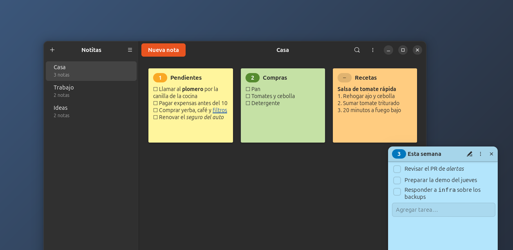
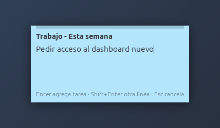
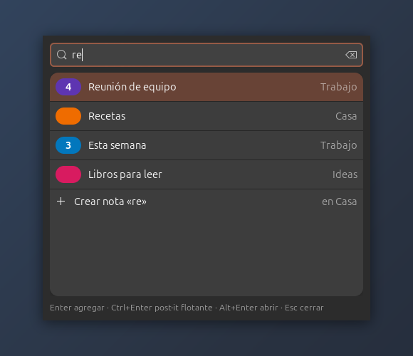
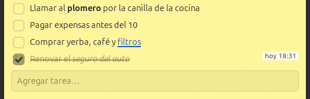
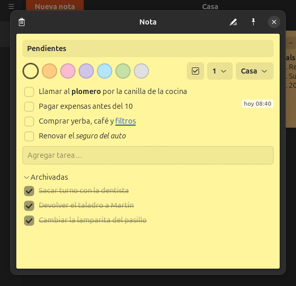

# Notitas

Notas tipo post-it para Ubuntu, pensadas para anotar **sin dejar lo que estás
haciendo**: desde cualquier programa, `Ctrl+Alt+1` abre un cuadradito del color
de la nota 1, escribís, Enter, y listo.



Liviana (Python + GTK 4, sin servidor ni Docker) y todo en **un único archivo
Markdown** que podés guardar en Dropbox.

## Instalar

Bajá el `.deb` de la [última versión](https://github.com/Raudcu/notitas/releases/latest)
y abrilo con doble clic, o:

```bash
sudo apt install ./notitas_*_all.deb
```

Requiere **Ubuntu 24.04 o posterior**. La primera vez que la abrís aparece una
bienvenida para elegir dónde guardar las notas y activar los atajos.

## Qué hace

### Capturar al vuelo

| Atajo | Qué hace |
|---|---|
| `Ctrl+Alt+1…9` | Abre un cuadradito del color de la nota con ese número. Escribís, **Enter** y se agrega al final (**Shift+Enter** = otra línea, **Esc** = cancelar; un clic afuera también la cierra si no escribiste nada). |
| `Ctrl+Alt+Shift+1…9` | Agrega a esa nota **lo que tengas seleccionado** (si no hay nada, lo copiado), sin abrir nada ni sacarte el foco. Un renglón entra como tarea (en notas de tareas); un bloque de varias líneas, tal cual. |
| `Ctrl+Alt+0` | Busca cualquier nota, o crea una nueva escribiendo su título. Enter = agregar · Ctrl+Enter = post-it flotante · Alt+Enter = abrir. |

<p>
  
  
</p>

### Tareas que se archivan solas

Las líneas `- [ ] …` se ven como casillas. Al tildar una se tacha, y enseguida
se va a **Archivadas**: una sección plegada al final de la nota, con lo último
que archivaste primero. La nota queda limpia y no perdés el historial. Si te
equivocaste, destildala en Archivadas y vuelve a la lista.

Para cambiar el orden, arrastrá una línea y soltala encima o debajo de otra;
sus sub-ítems (las líneas con más sangría) la acompañan.

Una nota con el botón ☑ activado es una **nota de tareas**: todo lo que le
llega por los atajos, pegado o desde el campo *Agregar tarea…* entra como
`- [ ]`. Las notas nuevas vienen así; si lo desactivás, entra como texto común.



Pasando el mouse por una línea aparece en gris **cuándo la escribiste** (o
cuándo la tildaste), como un *blame*.



### Organizar

- **Categorías** a la izquierda: se crean con **+**, se reordenan arrastrándolas
  y se renombran o eliminan desde el menú **⋮** de arriba a la derecha.
- **Notas**: *Nueva nota* crea una al final de la categoría abierta. Abierta, se le cambia
  el título, el **color** (7), el **número** del atajo (1–9, o ninguno) y la
  categoría; el tacho la elimina. Los números son únicos: si le das uno que ya
  tenía otra nota, se lo saca a esa.
- **Orden**: las notas quedan en orden de creación (la más nueva al final).
  Arrastrá una tarjeta para reordenarla, o soltala sobre una categoría para
  moverla ahí.
- **Clic derecho** en una tarjeta: abrirla o despegarla como post-it flotante.
- **Buscar** (`Ctrl+F` o la lupa): en todas las notas y categorías, incluidas
  las archivadas; resalta lo encontrado y muestra de qué categoría es cada nota.
- **Formato**: `**negrita**`, `*cursiva*`, `~~tachado~~`, `` `código` ``, listas
  con `-` o `1.` (con sub-ítems) y links clickeables (`[texto](https://…)` o
  URLs sueltas). Con el lápiz, o doble clic en una línea, se edita como texto.

### Post-its flotantes

Cualquier nota se despega a una ventanita **siempre encima**, visible en todos
los escritorios y fuera del dock: con clic derecho en la tarjeta, el 📌 de la
nota abierta, `Ctrl+Enter` en el buscador o desde el ícono de la barra. Se
edita y se tildan tareas ahí mismo. Desde su menú **⋮** se ajusta la
**opacidad**, el **tamaño de letra**, se **achica a solo el título** (también
con doble clic en la barra) o se abre en la ventana principal. Recuerdan
posición, tamaño y ajustes, y vuelven a aparecer al iniciar sesión.

### Siempre a mano

- **Ícono en la barra superior**: abrir Notitas, buscar, *Agregar a…* y
  *Pegar lo seleccionado en…* cualquier nota con número, mostrar u ocultar cada
  post-it flotante, y salir.
- **Clic derecho en el ícono del Dash**: *Buscar nota* y *Preferencias*.
- Cerrar la ventana no cierra la app: queda en segundo plano atendiendo los
  atajos. Para salir del todo: `Ctrl+Q` o *Salir* en el ícono de la barra.
- **Preferencias** (menú ☰): carpeta de las notas, carpeta de las copias de
  seguridad, atajos y arranque automático al iniciar sesión. Si elegís una
  carpeta que ya tiene un `notitas.md` (por ejemplo, la de Dropbox en otra
  computadora), usa ese. Los atajos también se pueden cambiar en
  Configuración → Teclado → Atajos personalizados.

## Dónde quedan las notas

Todo va en **un único archivo Markdown, `notitas.md`**, en la carpeta que elijas
en la bienvenida (por ejemplo `~/Dropbox/Notitas`). Se cambia desde el menú →
*Preferencias*.

```markdown
# General

## Casa
<!-- nota 3f2a9c1b0d4e · número 1 · color amarillo · tareas -->
- [ ] llamar al **plomero** <!-- 2026-09-25 09:15 -->
- [ ] pagar expensas <!-- 2026-09-26 11:30 -->
<!-- archivadas -->
- [x] comprar yerba <!-- 2026-09-26 10:00 · hecha 2026-09-26 19:13 -->
```

- `#` es una categoría y `##` una nota. Los comentarios `<!-- … -->` guardan los
  datos de la nota y la hora de cada línea. Los visores de Markdown no los muestran.
- Se puede editar a mano. Si el archivo cambia desde afuera (Dropbox, otra
  máquina, un editor), la app lo recarga sola.
- Se guarda de forma atómica: nunca queda un archivo a medio escribir.
- **Copias de seguridad**: una por hora (se conservan las últimas 72), por
  defecto en `~/.local/share/notitas/backups/`, fuera de la carpeta
  sincronizada. Se puede cambiar en *Preferencias*.

## Otras formas de instalar

**Sólo para tu usuario, sin sudo**, desde el código:

```bash
./install.sh      # instala en ~/.local
./uninstall.sh    # lo saca, sin tocar notas ni configuración
```

Si después pasás de esta instalación al `.deb` (o al revés), los atajos se
reapuntan solos.

## Desarrollo

```bash
bin/notitas                    # correr desde el código
bin/notitas --quick 1          # captura rápida a la nota 1
bin/notitas --paste 1          # agregar lo seleccionado a la nota 1
bin/notitas --pick             # selector
bin/notitas --preferences      # preferencias
bin/notitas --background       # arrancar sin ventana
make test                      # tests
make deb                       # paquete oficial (necesita: sudo apt install debhelper)
make deb-local                 # mismo paquete sin debhelper, sólo con dpkg-deb
```

El `.deb` queda en `dist/`. `make install PREFIX=… DESTDIR=…` define qué va a
dónde, y lo usan tanto `install.sh` como el paquete.

### Sacar una versión

La versión vive en tres lugares que tienen que coincidir: `VERSION` en
`notitas/__init__.py`, la primera entrada de `debian/changelog` y el metainfo.
El tag es `v` + esa versión. Un script actualiza todo junto:

```bash
packaging/release.sh 0.4.0 "Qué cambió" "Otra cosa que cambió"
git push origin main v0.4.0
```

El script hace el commit y crea el tag; al pushearlo, GitHub Actions
(`.github/workflows/deb.yml`) corre los tests, arma el `.deb` y publica el
Release con esas líneas como notas. En cada push a `main` también corre, pero
sólo deja el `.deb` como artefacto. Si las versiones no coinciden, falla.

## Stack

Python 3 del sistema + GTK 4 + libadwaita (PyGObject). Sin servidor, sin Docker,
sin dependencias fuera de apt. Los atajos son *atajos personalizados* de GNOME
(Configuración → Teclado).

"Siempre encima", la posición de los post-its, el foco de la ventanita rápida y
que el aviso de "Pegado" no robe el foco usan X11. En Wayland todo lo demás
funciona, pero eso queda en manos de GNOME (y leer el portapapeles sin tener el
foco puede no estar permitido; lo seleccionado, tampoco).

| Archivo | Qué hace |
|---|---|
| `notitas/__main__.py` | Entrada; `--quick`/`--paste`/`--pick` le hablan por D-Bus a la instancia viva (~0,1 s) |
| `notitas/app.py` | `Adw.Application`: opciones, acciones, post-its flotantes, menú de la barra |
| `notitas/store.py` | Modelo, hora por línea (diff), guardado atómico, backups, recarga externa |
| `notitas/fileformat.py` | Lectura/escritura del `notitas.md` |
| `notitas/config.py` | `~/.config/notitas`: carpetas, bienvenida hecha, arranque automático, estado de ventanas |
| `notitas/prefs.py` | Preferencias y bienvenida |
| `notitas/window.py` | Ventana principal, búsqueda, tarjetas (arrastrables), editor y diálogos |
| `notitas/noteview.py` | Contenido de una nota: tareas tildables, archivadas, edición como texto |
| `notitas/markup.py` | Markdown mínimo → texto con formato |
| `notitas/quick.py` | Ventanita de captura rápida |
| `notitas/picker.py` | Selector general (Ctrl+Alt+0) |
| `notitas/floating.py` | Post-it flotante |
| `notitas/blame.py` | Hora de la línea al pasar el mouse |
| `notitas/tray.py` | Ícono en la barra superior (StatusNotifierItem + dbusmenu) |
| `notitas/x11.py` | Foco, siempre encima y posición en X11 |
| `notitas/shortcuts.py` | Alta/baja de los atajos en GNOME |
| `debian/` | Paquete Debian (también sirve para un PPA de Launchpad) |
| `packaging/build-deb-local.sh` | Arma el `.deb` sin debhelper |
| `packaging/release.sh` | Prepara una versión nueva (versión + changelog + tag) |
| `tests/` | Tests (`make test`) |

Licencia: MIT.
